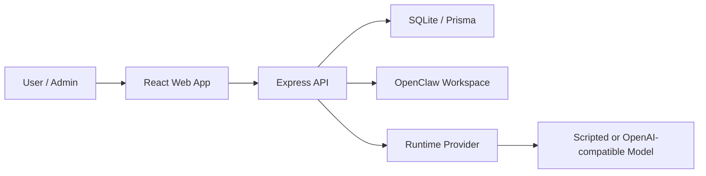

# Agent Collaboration Workbench

[](https://github.com/hanlee118/ai-agent-/actions/workflows/ci.yml)
[](https://github.com/hanlee118/ai-agent-/actions/workflows/pages.yml)
[](https://github.com/hanlee118/ai-agent-/releases)

一个面向真实 OpenClaw 团队协作的 Agent 工作台。它把项目管理、Agent 指挥、任务治理、SOUL/SOP 配置、长期记忆、审计追踪和系统运行检查收敛到一个更接近 SaaS 管理后台的工作平台中。

在线项目主页：
[https://hanlee118.github.io/ai-agent-/](https://hanlee118.github.io/ai-agent-/)

仓库地址：
[https://github.com/hanlee118/ai-agent-](https://github.com/hanlee118/ai-agent-)

## 核心价值

- 不是单聊天窗口，而是完整的 Agent 团队协作控制台
- 不是纯演示页面，而是可连接真实 OpenClaw 工作区的运行平台
- 不是只看结果，而是能管理模型、执行策略、审批机制、Token 上限、长期记忆和审计日志

## v1.0.0 已实现能力

- 自然语言创建项目，并生成理解确认卡
- 统一查看 `Dashboard`、`Projects`、`Project Room`、`OpenClaw Workspace`、`Agents`、`Agent Commander`、`System`、`Audit`、`Settings`
- 读取真实 `~/.openclaw` 或自定义 `OPENCLAW_ROOT` 工作区中的项目、Agent、任务、文档、会话和最近消息
- 在单个 Agent 指挥页中独立切换模型、切换执行策略、预览理解确认卡、下发任务
- 支持 `confirm_first` / `autonomous` 两种执行模式
- 支持为每个 Agent 配置 Token 限额、治理信息、协作白名单、工具白名单
- 支持持久化 Agent 长期记忆、调用日志和当日 Token 使用摘要
- 支持通过平台创建新的 OpenClaw Agent，并同步写入真实工作区配置
- 支持系统健康检查、平台就绪度检查、运行配置校验和审计日志查询
- 新增本地多工具会话监控，统一观察 Codex、Claude Code 与 OpenClaw 的最近会话和活跃状态
- 支持中文 / 英文双语切换

## 产品结构

```text
apps/
  api/        Express API + Prisma + SQLite + OpenClaw integration
  web/        React + Vite frontend
packages/
  shared/     共享类型、接口和契约
docs/         产品、需求、架构、设计与部署文档
aistudio/     AI Studio 导出的前端参考工程
scripts/      发布、校验、备份、守护脚本
site/         GitHub Pages 项目主页
```

## 架构概览



## 快速开始

### 1. 安装依赖

```bash
pnpm install
```

### 2. 初始化数据库

```bash
pnpm --filter @occ/api db:generate
pnpm --filter @occ/api db:push
pnpm --filter @occ/api db:seed
```

如果本机 Prisma SQLite `db:push` 出现 schema engine 异常，可使用兜底方式：

```bash
pnpm --filter @occ/api db:bootstrap
pnpm --filter @occ/api db:seed
```

### 3. 本地开发

```bash
pnpm dev:api
pnpm dev:web
```

默认前端访问 `http://localhost:5173`，API 默认监听 `http://localhost:8787`。

### 4. 单服务生产启动

```bash
pnpm build
pnpm start:prod
```

## 环境变量

后端示例环境文件位于：
[apps/api/.env.example](apps/api/.env.example)

当前支持的关键变量：

- `DATABASE_URL`
- `MODEL_PROVIDER`
- `MODEL_API_BASE_URL`
- `MODEL_API_KEY`
- `MODEL_NAME`
- `OPENCLAW_ROOT`
- `OPENCLAW_CONFIG_PATH`
- `OPENCLAW_WORKSPACE_ROOT`
- `CODEX_SESSIONS_ROOT`
- `CLAUDE_PROJECTS_ROOT`
- `OPENCLAW_AGENT_ROOT`
- `APP_SECRET`
- `PORT`

其中：

- `OPENCLAW_ROOT` 允许你在服务器或容器里把 OpenClaw 数据挂载到自定义目录
- `OPENCLAW_CONFIG_PATH` 与 `OPENCLAW_WORKSPACE_ROOT` 可单独覆盖默认路径
- `CODEX_SESSIONS_ROOT`、`CLAUDE_PROJECTS_ROOT`、`OPENCLAW_AGENT_ROOT` 允许你定制 Nexus 风格的本地会话监控根目录
- 未显式配置时，系统默认使用 `~/.openclaw`

## 数据与治理能力

当前数据库已覆盖以下核心治理模型：

- `ManagedAgentConfig`
  - 当前模型、默认模型、回退模型
  - 执行模式、确认策略、Token 限额、记忆开关
  - 显示名称、职位、介绍、职责
  - 协作 Agent 白名单、工具白名单
- `AgentMemoryEntry`
  - 长期记忆类型、摘要、正文、重要度、标签、来源
- `AgentUsageLog`
  - 输入 Token、输出 Token、总用量、状态、调用类型

## 关键接口

### 基础平台

- `GET /api/auth/status`
- `POST /api/auth/setup`
- `POST /api/auth/login`
- `POST /api/auth/logout`
- `GET /api/projects`
- `POST /api/projects`
- `GET /api/projects/:id`
- `GET /api/projects/:id/tasks`
- `PATCH /api/tasks/:taskId`
- `GET /api/system/runtime`
- `PUT /api/system/runtime/config`
- `POST /api/system/runtime/validate`
- `GET /api/system/health`
- `GET /api/system/readiness`
- `GET /api/system/audit-logs`

### OpenClaw

- `GET /api/openclaw/workspace`
- `GET /api/openclaw/projects`
- `GET /api/openclaw/projects/:projectId`
- `PATCH /api/openclaw/projects/:projectId/tasks/:taskId`
- `PATCH /api/openclaw/projects/:projectId/tasks`
- `GET /api/openclaw/projects/:projectId/report`
- `GET /api/openclaw/agents`
- `POST /api/openclaw/agents`
- `GET /api/openclaw/agents/:agentId`
- `PUT /api/openclaw/agents/:agentId/settings`
- `POST /api/openclaw/agents/:agentId/preview`
- `PUT /api/openclaw/agents/:agentId/soul`
- `PUT /api/openclaw/agents/:agentId/sop`
- `POST /api/openclaw/agents/:agentId/message`
- `POST /api/openclaw/agents/batch-message`
- `POST /api/openclaw/agents/:agentId/memory`
- `GET /api/openclaw/sla`

## 文档索引

- [产品说明文档](docs/V1_0_0_PRODUCT_OVERVIEW.md)
- [需求文档](docs/V1_0_0_REQUIREMENTS_SPEC.md)
- [技术文档](docs/V1_0_0_TECHNICAL_DOCUMENTATION.md)
- [部署指南](docs/DEPLOYMENT_GUIDE.md)
- [操作手册](docs/OPERATION_MANUAL.md)
- [生产检查清单](docs/PRODUCTION_CHECKLIST.md)

## 正式发布路径

### A. 仓库主页与公开介绍

本仓库内置 GitHub Pages 站点配置。推送到 `main` 后，GitHub Actions 会自动把 [site/index.html](site/index.html) 发布到稳定公开地址：
[site/index.html](site/index.html)

[https://hanlee118.github.io/ai-agent-/](https://hanlee118.github.io/ai-agent-/)

### B. 可长期运行的正式部署

本仓库已补齐以下正式部署资产：

- [Dockerfile](Dockerfile)
- [.dockerignore](.dockerignore)
- [render.yaml](render.yaml)
- [scripts/start-render.sh](scripts/start-render.sh)

这意味着你可以把当前项目直接接入：

- Render
- Railway
- 自有 Linux 云主机
- Docker / Docker Compose 环境

注意：如果你要保留真实 OpenClaw 联动，正式环境必须为 SQLite 数据文件和 OpenClaw 工作区提供持久化目录。

## 验证命令

```bash
pnpm typecheck
pnpm build
pnpm verify:local
```

## 当前版本说明

v1.0.0 已经是一个真实可用的本地生产版本，不再是单纯演示工程。它适合作为：

- 企业 Agent 协作平台原型
- 私有化部署的本地工作台
- 多 Agent 团队治理底座
- 后续 1.x 版本持续演进的基线
