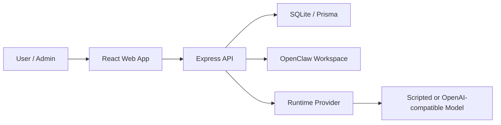

# Agent Collaboration Workbench

[](https://github.com/hanlee118/ai-agent-/actions/workflows/ci.yml)
[](https://github.com/hanlee118/ai-agent-/actions/workflows/pages.yml)
[](https://github.com/hanlee118/ai-agent-/releases)

一个面向真实 OpenClaw 团队协作的 Agent 工作台。它把项目管理、Agent 指挥、任务治理、SOUL/SOP 配置、长期记忆、审计追踪和系统运行检查收敛到一个更接近 SaaS 管理后台的工作平台中。

在线项目主页：
[https://hanlee118.github.io/ai-agent-/](https://hanlee118.github.io/ai-agent-/)

仓库地址：
[https://github.com/hanlee118/ai-agent-](https://github.com/hanlee118/ai-agent-)

## 核心价值

- 不是单聊天窗口，而是完整的 Agent 团队协作控制台
- 不是纯演示页面，而是可连接真实 OpenClaw 工作区的运行平台
- 不是只看结果，而是能管理模型、执行策略、审批机制、Token 上限、长期记忆和审计日志

## v1.0.3 当前已实现能力

- 自然语言创建项目，并生成理解确认卡
- 统一查看 `Dashboard`、`Projects`、`Project Room`、`OpenClaw Workspace`、`Agents`、`Agent Commander`、`System`、`Audit`、`Settings`
- 读取真实 `~/.openclaw` 或自定义 `OPENCLAW_ROOT` 工作区中的项目、Agent、任务、文档、会话和最近消息
- 在单个 Agent 指挥页中独立切换模型、切换执行策略、预览理解确认卡、下发任务
- 支持 `confirm_first` / `autonomous` 两种执行模式
- 支持为每个 Agent 配置 Token 限额、治理信息、协作白名单、工具白名单
- 支持持久化 Agent 长期记忆、调用日志和当日 Token 使用摘要
- 支持通过平台创建新的 OpenClaw Agent，并同步写入真实工作区配置
- 支持系统健康检查、平台就绪度检查、运行配置校验和审计日志查询
- 新增本地多工具会话监控，统一观察 Codex、Claude Code 与 OpenClaw 的最近会话和活跃状态
- 支持中文 / 英文双语切换
- 已接入新的 Slack / AI Studio 风格工作台壳层，当前运行实例不再使用旧版页面骨架
- 新增“闭环验收”自动化脚本，可实际验证项目流、OpenClaw 团队流、Agent 指挥流、运行配置流与任务回写流

## 产品结构

```text
apps/
  api/        Express API + Prisma + SQLite + OpenClaw integration
  web/        React + Vite frontend
packages/
  shared/     共享类型、接口和契约
docs/         产品、需求、架构、设计与部署文档
aistudio/     AI Studio 导出的前端参考工程
scripts/      发布、校验、备份、守护脚本
site/         GitHub Pages 项目主页
```

## 架构概览



## Agent Team 执行协议

当前平台已经把“立项 -> 分析 -> 设计 -> 研发 -> 验收 -> 回填”统一到一套更适合 Agent Team 的执行协议里：

- 长期记忆默认保持开启，但只允许当前项目或高关联经验参与关键执行
- 关键阶段优先走终端 Agent、技能驱动和真实验证
- 每个关键阶段必须产出协作交接卡与技能执行记录
- 关键阶段若触发 `scripted` / `degraded`，不得当作真实成功结果写回

详细规则见：

- [Agent Team 执行协议](docs/AGENT_TEAM_EXECUTION_PROTOCOL.md)
- [Agent Team 立项协议 v1](docs/AGENT_TEAM_INIT_PROTOCOL.md)
- [Agent Team 研发执行协议 v1](docs/AGENT_TEAM_DELIVERY_PROTOCOL.md)
- [设计模型调用标准](docs/DESIGN_MODEL_POLICY.md)

## 快速开始

### 1. 安装依赖

```bash
pnpm install
```

### 2. 初始化数据库

```bash
pnpm --filter @occ/api db:generate
pnpm --filter @occ/api db:push
pnpm --filter @occ/api db:seed
```

如果本机 Prisma SQLite `db:push` 出现 schema engine 异常，可使用兜底方式：

```bash
pnpm --filter @occ/api db:bootstrap
pnpm --filter @occ/api db:seed
```

### 数据库策略（当前建议）

- 当前保持 `SQLite + Prisma`，对现阶段规模（几千级项目/任务）足够，迭代成本最低。
- 所有业务访问统一走 `apps/api/src/db.ts` 导出的 Prisma Client，不在业务代码里散落数据库实例。
- 查询统一走 Prisma API，避免在业务路径引入原始 SQL。
- 现在就保留 PostgreSQL 切换能力（但不立即切换），等到并发/容量达到阈值后再迁移。

PostgreSQL 迁移时建议步骤：

```bash
# 1) 更新 DATABASE_URL 为 postgresql://...
# 2) 将 prisma/schema.prisma 的 datasource provider 从 sqlite 改为 postgresql
pnpm --filter @occ/api db:generate
pnpm --filter @occ/api db:migrate:deploy
```

补充：

- 本仓库当前以 `db:push` 为主流程；若要正式采用迁移文件流，先在目标环境前完成一次基线迁移梳理。

### 数据库基线与体检（快捷入口）

在日常开发、联调与发布前，建议固定执行以下三步：

```bash
cd /tmp/ai-agent-check
pnpm db:baseline
pnpm --filter @occ/api db:migrate:status
pnpm health:check
```

说明：

- `pnpm db:baseline`：确保当前 Prisma schema 有可部署的基线迁移文件。
- `pnpm --filter @occ/api db:migrate:status`：确认迁移状态为 up to date。
- `pnpm health:check`：一键检查 DB、OpenAPI、关键路由可用性，并输出报告到 `docs/reports/`。

相关文档：

- [Prisma 迁移基线](docs/PRISMA_MIGRATION_BASELINE.md)
- [PostgreSQL 切换手册](docs/POSTGRESQL_SWITCH_RUNBOOK.md)

### 3. 本地开发

```bash
pnpm dev:api
pnpm dev:web
```

默认前端访问 `http://localhost:5173`，API 默认监听 `http://localhost:8787`。

### 4. 单服务生产启动

```bash
pnpm build
pnpm start:prod
```

## 环境变量

后端示例环境文件位于：
[apps/api/.env.example](apps/api/.env.example)

当前支持的关键变量：

- `DATABASE_URL`
- `MODEL_PROVIDER`
- `MODEL_API_BASE_URL`
- `MODEL_API_KEY`
- `MODEL_NAME`
- `OPENCLAW_ROOT`
- `OPENCLAW_CONFIG_PATH`
- `OPENCLAW_WORKSPACE_ROOT`
- `CODEX_SESSIONS_ROOT`
- `CLAUDE_PROJECTS_ROOT`
- `OPENCLAW_AGENT_ROOT`
- `APP_SECRET`
- `PORT`
- `HOST`

其中：

- `OPENCLAW_ROOT` 允许你在服务器或容器里把 OpenClaw 数据挂载到自定义目录
- `OPENCLAW_CONFIG_PATH` 与 `OPENCLAW_WORKSPACE_ROOT` 可单独覆盖默认路径
- `CODEX_SESSIONS_ROOT`、`CLAUDE_PROJECTS_ROOT`、`OPENCLAW_AGENT_ROOT` 允许你定制 Nexus 风格的本地会话监控根目录
- 未显式配置时，系统默认使用 `~/.openclaw`

## 数据与治理能力

当前数据库已覆盖以下核心治理模型：

- `ManagedAgentConfig`
  - 当前模型、默认模型、回退模型
  - 执行模式、确认策略、Token 限额、记忆开关
  - 显示名称、职位、介绍、职责
  - 协作 Agent 白名单、工具白名单
- `AgentMemoryEntry`
  - 长期记忆类型、摘要、正文、重要度、标签、来源
- `AgentUsageLog`
  - 输入 Token、输出 Token、总用量、状态、调用类型

## 关键接口

### 基础平台

- `GET /api/auth/status`
- `POST /api/auth/setup`
- `POST /api/auth/login`
- `POST /api/auth/logout`
- `GET /api/projects`
- `POST /api/projects`
- `GET /api/projects/:id`
- `GET /api/projects/:id/tasks`
- `PATCH /api/tasks/:taskId`
- `GET /api/system/runtime`
- `PUT /api/system/runtime/config`
- `POST /api/system/runtime/validate`
- `GET /api/system/health`
- `GET /api/system/readiness`
- `GET /api/system/design-model-policy/health`
- `POST /api/system/design-model-policy/repair`
- `GET /api/system/audit-logs`

### OpenClaw

- `GET /api/openclaw/workspace`
- `GET /api/openclaw/projects`
- `GET /api/openclaw/projects/:projectId`
- `PATCH /api/openclaw/projects/:projectId/tasks/:taskId`
- `PATCH /api/openclaw/projects/:projectId/tasks`
- `GET /api/openclaw/projects/:projectId/report`
- `GET /api/openclaw/agents`
- `POST /api/openclaw/agents`
- `GET /api/openclaw/agents/:agentId`
- `PUT /api/openclaw/agents/:agentId/settings`
- `POST /api/openclaw/agents/:agentId/preview`
- `PUT /api/openclaw/agents/:agentId/soul`
- `PUT /api/openclaw/agents/:agentId/sop`
- `POST /api/openclaw/agents/:agentId/message`
- `POST /api/openclaw/agents/batch-message`
- `POST /api/openclaw/agents/:agentId/memory`
- `GET /api/openclaw/sla`

### GitLab Harness（实施与验收闭环）

- `POST /api/gitlab/harness/projects/:occProjectId/sync`
  - 将 OCC 项目 `DEV/ACCEPT` 阶段任务同步为 GitLab Issue（含 `OCC_PROJECT_ID`、`OCC_TASK_ID` 机器标记）。
- `POST /api/gitlab/webhook`
  - 接收 Issue 状态回写：`closed -> done`，`opened/reopened -> in_progress`。
- 项目执行关键动作（`submit/approve/reject/intervene/resume/close/task update`）和自动推进 tick 均会触发 Harness 同步。
- 项目完成或关闭时，会自动执行 `closeOnComplete`，关闭同项目下仍打开的 Harness Issue。

### 仓库治理约定

- `main` 仅保留可发布代码，所有功能开发在 `codex/*` 分支完成并回合到 `main`。
- 临时日志、运行缓存、本地数据库、`node_modules`、构建产物不得入库。
- 每轮改造需同步更新 `docs/` 与桌面主文档，确保“仓库版”和“本地版”一致。

## 文档索引

- [最新版本对比说明](docs/LATEST_VERSION_COMPARISON.md)
- [最新产品方案](docs/LATEST_PRODUCT_PROPOSAL.md)
- [最新需求文档](docs/LATEST_REQUIREMENTS_SPEC.md)
- [最新技术文档](docs/LATEST_TECHNICAL_DOCUMENTATION.md)
- [产品说明文档](docs/V1_0_1_PRODUCT_OVERVIEW.md)
- [需求文档](docs/V1_0_1_REQUIREMENTS_SPEC.md)
- [技术文档](docs/V1_0_0_TECHNICAL_DOCUMENTATION.md)
- [v1.0.3 发布说明](docs/release-notes/v1.0.3.md)
- [v1.0.1 发布说明](docs/RELEASE_NOTES_1.0.1.md)
- [部署指南](docs/DEPLOYMENT_GUIDE.md)
- [操作手册](docs/OPERATION_MANUAL.md)
- [生产检查清单](docs/PRODUCTION_CHECKLIST.md)
- [设计模型调用标准](docs/DESIGN_MODEL_POLICY.md)
- [前端重构架构](docs/ARCHITECTURE.md)
- [前端冒烟检查清单](docs/SMOKE_CHECKLIST.md)

## 正式发布路径

### A. 仓库主页与公开介绍

本仓库内置 GitHub Pages 站点配置。推送到 `main` 后，GitHub Actions 会自动把 [site/index.html](site/index.html) 发布到稳定公开地址：
[site/index.html](site/index.html)

[https://hanlee118.github.io/ai-agent-/](https://hanlee118.github.io/ai-agent-/)

### B. 可长期运行的正式部署

本仓库已补齐以下正式部署资产：

- [Dockerfile](Dockerfile)
- [.dockerignore](.dockerignore)
- [render.yaml](render.yaml)
- [scripts/start-render.sh](scripts/start-render.sh)

这意味着你可以把当前项目直接接入：

- Render
- Railway
- 自有 Linux 云主机
- Docker / Docker Compose 环境

注意：如果你要保留真实 OpenClaw 联动，正式环境必须为 SQLite 数据文件和 OpenClaw 工作区提供持久化目录。

## 验证命令

```bash
pnpm typecheck
pnpm build
pnpm verify:local
pnpm verify:smoke
pnpm verify:closure
pnpm test:smoke
pnpm test:acceptance
```

其中 `pnpm verify:smoke` 会验证：

- 公共健康接口
- 受保护接口鉴权
- OpenClaw 工作区核心 API
- 本地会话监控聚合接口
- 本地会话监控 SSE 首帧推送

`pnpm verify:closure` 会进一步验证：

- 项目创建、消息、介入、恢复、阶段提交、驳回、再提交、审批推进
- 普通任务状态更新
- 运行配置保存与校验
- OpenClaw 工作区读取、项目报告生成、任务回写与批量回写
- Agent 创建、理解预览、治理设置、SOUL / SOP 保存、长期记忆写入、单发与批量指令
- 测试后自动清理临时项目、临时 Agent、测试记忆和回写改动

## 当前版本说明

v1.0.3 是在 v1.0.2 基础上的协议执行与真实交付收敛补丁版本。它继续强化“真实执行、真实门禁、真实派工”，避免把静态演示页、模板稿或混杂日志误判成真实结果。它适合作为：

- 企业 Agent 协作平台原型
- 私有化部署的本地工作台
- 多 Agent 团队治理底座
- 后续 1.x 版本持续演进的基线

### 2026-04-04 最新更新（协议收敛、垃圾数据清理与发版）

- 修复 OpenClaw `agent --json` 混合 stdout/stderr 噪音导致的 JSON 解析失败。
- 修复 INIT 审批门禁对技能证据的误拦截，以及协作证据缺失时不能从当前交付物回填的问题。
- 加强阶段执行卡：仅显示当前阶段相关角色按钮，并为研发 / QA 增加轻量派工摘要、阻断/全部缺口切换、纯文本/Markdown 切换。
- 清理本地推荐测试项目 7 个，避免复测项目继续污染项目列表。
- 清空 `apps/web/public/generated` 下历史静态生成页，避免演示残留干扰真实交付判断。

### 2026-04-01 历史更新（收敛与验收）

- 完成后端收敛增强：`advance` 退避恢复、门禁与健康检查链路强化。
- 增加可重复验收脚本：`pnpm verify:repeatable:018`。
- 完成 GitLab Harness 真实链路验收（本地 GitLab + 真实 Issue 创建/回查）：
  - 报告：[docs/reports/harness-e2e-latest.json](docs/reports/harness-e2e-latest.json)
- 仓库清理：移除历史 `apps/web/public/generated` 自动生成 HTML，避免无效产物污染主干。
