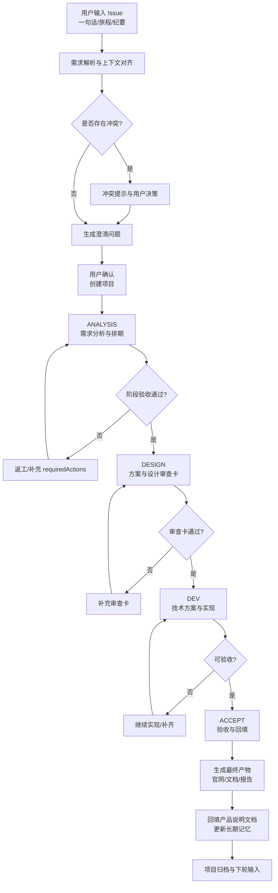
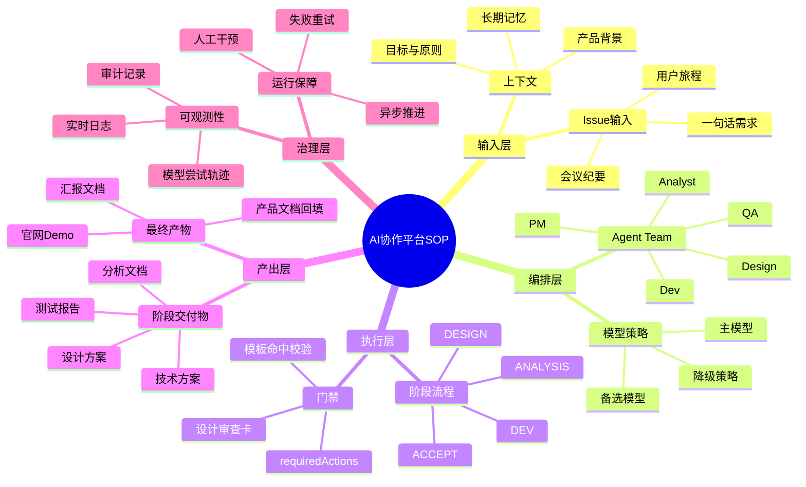

# AI协作平台需求文档（含需求说明 / 流程图 / 思维导图）

- 文档版本：v20260331
- 适用范围：当前 AI Agent 协作研发平台（Project/Issue/Agent/Deliverables）
- 编制目标：统一平台 SOP，保障“需求输入 -> 研发执行 -> 验收回填”闭环可持续运行

## 1. 产品定位与目标

### 1.1 产品定位
AI协作平台是一个以 Agent Team + 模型编排为核心的研发执行系统。用户仅需输入一句话需求、用户旅程或会议纪要，系统即可完成需求分析、任务拆解、协作执行、交付验收与文档回填。

### 1.2 核心目标
1. 将非结构化需求转化为可执行项目。
2. 用可审计的阶段门禁保证产物质量。
3. 用多角色 Agent 协作提升执行速度与一致性。
4. 形成可持续迭代的产品说明文档（长期记忆）。

### 1.3 成功标准（北极星）
1. 项目从创建到验收可全程自动推进且无阻塞卡死。
2. 每阶段必有可查阅产物，且通过模板门禁。
3. 最终产物可直接用于对外汇报与内部实施。
4. 新需求与长期记忆冲突时可被识别并引导用户决策。

## 2. 适用开发模式与 SOP 结论

### 2.1 推荐模式
采用 **Stage-Gated Agile（阶段门禁 + 敏捷迭代 + Kanban流控）**。

### 2.2 原因
1. 纯瀑布：门禁强，但对高不确定输入（一句话需求）适应性差。
2. 纯敏捷：适应性强，但门禁与审计不足，容易产物漂移。
3. 混合模式：既有门禁质量控制，又保持快速迭代和并行执行效率。

### 2.3 平台阶段定义（统一）
1. `INIT`：立项与上下文对齐
2. `ANALYSIS`：需求分析与边界确认
3. `DESIGN`：方案设计与审查确认
4. `DEV`：技术实现与联调产出
5. `ACCEPT`：验收、回填与归档

## 3. 需求文档（PRD）

### 3.1 用户与角色
1. 产品负责人（Owner）：输入需求、做关键确认、验收结果。
2. 项目经理 Agent（ROLE_PM）：推进节奏、阶段切换、风险提示。
3. 分析 Agent（ROLE_ANALYST）：提炼目标、约束、风险、验收标准。
4. 设计 Agent（ROLE_DESIGN）：输出结构化方案与设计审查卡。
5. 开发 Agent（ROLE_DEV/ROLE_ARCH）：技术选型、实现与联调。
6. 测试/验收 Agent（ROLE_QA）：验收检查、回填与复盘。

### 3.2 功能需求（FR）
1. `FR-01` 需求输入：支持一句话、用户旅程、会议纪要作为 Issue 输入。
2. `FR-02` 需求解析：自动提取目标、范围、约束、风险、优先级。
3. `FR-03` 多角色讨论：基于 Issue 生成角色化结论、分歧与待确认项。
4. `FR-04` 最小澄清：以 2-3 个必答问题完成关键信息补齐。
5. `FR-05` 团队自动编排：根据行业/项目类型分配角色集与模型策略。
6. `FR-06` 阶段门禁：每阶段必须具备必需交付物并通过模板校验。
7. `FR-07` 手动推进与自动推进：支持后台推进任务化，防止接口阻塞。
8. `FR-08` 实时输出流：展示 Agent 执行日志、状态、失败原因与重试轨迹。
9. `FR-09` 可干预机制：支持暂停/恢复/关闭/删除，支持阻塞任务处置。
10. `FR-10` 最终产物：生成官网/demo、方案文档、验收报告、回填文档。
11. `FR-11` 冲突检测：新需求与产品说明文档冲突时必须提示并待决策。
12. `FR-12` 长期记忆治理：支持查看、编辑、删除错误记忆，避免污染。

### 3.3 非功能需求（NFR）
1. 可用性：关键接口可重试，失败可回退，不出现长时间无反馈。
2. 性能：`/projects/:id/advance` 需快速响应（异步推进，不阻塞）。
3. 可观测性：项目执行轨迹、模型尝试、错误码可审计。
4. 一致性：交付物模板和验收标准统一，避免风格漂移。
5. 安全性：敏感配置（API Key）加密存储，权限控制可配置。

### 3.4 阶段输入/输出与门禁

#### INIT
- 输入：原始需求文本 + 产品长期记忆
- 输出：项目章程
- 门禁：项目目标、范围、阶段负责人齐全

#### ANALYSIS
- 输入：Issue + 业务背景 + 约束
- 输出：需求分析文档、项目排期方案
- 门禁：包含目标/边界/风险/验收标准/关键里程碑

#### DESIGN
- 输入：分析结论与排期
- 输出：客户汇报方案、实施说明、设计审查卡
- 门禁：审查卡“通过”，关键章节完整

#### DEV
- 输入：设计审查通过产物
- 输出：技术方案与选型、Demo原型说明
- 门禁：关键路径可运行、依赖风险说明完整

#### ACCEPT
- 输入：开发阶段输出
- 输出：测试报告、产品说明文档回填、验收结论
- 门禁：必需交付物齐全且 readyForAcceptance=true

## 4. 需求说明（SRS）

### 4.1 主链路说明
1. 用户提交 Issue。
2. 系统解析并与长期记忆对齐。
3. Agent Team 讨论并生成澄清问题。
4. 用户完成确认后创建项目。
5. 项目按阶段执行并产出交付物。
6. 每阶段验收通过后进入下一阶段。
7. 最终验收完成后回填产品说明文档。

### 4.2 异常处理说明
1. 推进中：返回 `PROJECT_ADVANCE_IN_PROGRESS`，前端显示“后台推进中”。
2. 需人工介入：返回 `REQUIRES_USER_INTERVENTION` + `requiredActions`。
3. 推进失败：返回 `PROJECT_ADVANCE_FAILED`，并提示进入项目详情处理。
4. 设计门禁失败：强制要求提交设计审查卡后再推进。
5. 模型降级：显示 `refresh_runtime` 引导修复通道。

### 4.3 数据实体（核心）
1. Project：id、name、status、currentStage、progress、pendingApproval
2. Stage：type、status、assignee、progress、startedAt、endedAt
3. Task：stageType、title、assignee、status、priority
4. Deliverable：stageType、name、content、version、status
5. TimelineEvent：timestamp、type、title、content、agentId
6. ProjectExecution：action、model、provider、status、latency、attempts
7. ProductContext：背景、目标、原则、使命、长期记忆

### 4.4 验收标准
1. 创建项目后可进入 `ANALYSIS`。
2. 阶段流转必须为 `ANALYSIS -> DESIGN -> DEV -> ACCEPT`。
3. 每阶段可查阅产物，且非空、可审阅。
4. `final-artifacts` 返回 ready 且 missingRequired 为空。
5. `official-site` 返回可访问链接。

## 5. 流程图（Mermaid）

## 6. 思维导图（Mermaid）

## 7. SOP实施建议（可直接落地）

1. 以“阶段门禁”作为主骨架，不允许跨阶段跳验收。
2. 以“requiredActions”作为统一干预机制，所有阻塞都可解释。
3. 以“交付物模板命中校验”作为质量红线，未命中不得通过。
4. 以“异步推进 + 自动刷新”保证用户体验不抖动不卡死。
5. 以“产品说明文档回填”维持长期一致性与版本演进。

## 8. 本文档输出位置

- 本文件已生成到桌面：
`/Users/dalongxia/Desktop/AI协作平台_需求文档_需求说明_流程图_思维导图_v20260331.md`

## 9. 实施成果固化更新（2026-03-31）

### 9.1 本次已完成并推送到 GitHub 的内容
1. ProjectRoom 页面目录化组件重构（等价重构，不改业务目标）。
2. 新增共享模块 `projectRoomShared.ts`，统一阶段/交付物/日志等公共常量与纯函数。
3. 修复 `ProjectRoom` 相关类型对齐问题，确保 `vite build` 与 `tsc --noEmit` 同时通过。
4. 补充并固化本轮回归测试报告与健康检查报告。

Git 分支与提交：
- 分支：`codex/lifecycle-acceptance-20260331`
- 提交：`c1a6e61`
- 远程：`git@github.com:hanlee118/ai-agent-.git`

### 9.2 当前运行与验证状态（本地实测）
1. `pnpm build`：通过
2. `pnpm typecheck`：通过
3. `pnpm --filter @occ/api test:routes`：通过（17/17）
4. `pnpm verify:local`：通过
5. `pnpm health:check`：通过（8/8）
6. 运行态接口：`/health`、`/ready`、`/api/docs.json` 均返回 200。

### 9.3 本次固化证据路径
1. `/tmp/ai-agent-check/docs/reports/overall-optimization-regression-2026-03-31.md`
2. `/tmp/ai-agent-check/docs/reports/system-health-check-2026-03-31T13-33-35-480Z.json`
3. `/tmp/ai-agent-check/docs/reports/system-health-check-latest.json`

### 9.4 当前可用结论
平台已达到“可运行、可回归、可验收”的阶段性稳定状态，可继续进入下一轮：
1. `ProjectRoomPage/index.tsx` 继续拆分 SSE 与 URL 状态逻辑。
2. 增加前端组件层单测，降低后续重构回归风险。
3. 保持“真实模型门禁 + 阶段产物可查阅”作为上线前必检项。

### 9.5 全流程复测报告追加（2026-03-31 晚间）

#### 9.5.1 复测范围
1. 新建项目全流程：`创建 -> ANALYSIS -> DESIGN -> DEV -> ACCEPT -> 完成`。
2. 阶段门禁与最终产物：`final-artifacts`、`official-site`、阶段审批链路。
3. 真实模型门禁异常分支：`REAL_MODEL_GATE_FAILED` 的引导动作完整性。

#### 9.5.2 复测结论
1. 全流程复测结论：通过（已跑通到 `completed`）。
2. 最终验收状态：`readyForAcceptance=true` 且 `missingRequired=[]`。
3. 官网产物接口：返回 200，并可返回产物 URL。
4. 门禁引导修复：当 `REAL_MODEL_GATE_FAILED` 发生时，现已强制返回 `refresh_runtime`，避免误导用户直接验收。

#### 9.5.3 本轮修复与回归
1. 修复文件：`apps/api/src/routes/projects.ts`
   - `POST /api/projects/:id/approve` 在 `REAL_MODEL_GATE_FAILED` 分支中，始终补齐 `refresh_runtime` 动作。
2. 回归增强：`apps/api/src/routes/routes.test.ts`
   - 新增断言：`REAL_MODEL_GATE_FAILED` 响应必须包含 `refresh_runtime`。
3. 回归结果：`pnpm --filter @occ/api test:routes` 通过（17/17）。

#### 9.5.4 固化证据
1. 全流程复测报告：
   - `/tmp/ai-agent-check/docs/reports/e2e-project-flow-recheck-2026-03-31.md`
2. 本轮优化+测试报告：
   - `/tmp/ai-agent-check/docs/reports/optimization-test-report-2026-03-31-real-model-gate.md`
3. 对应提交（同一实施分支）：
   - `65e1576`（全流程推进与复测修复）
   - `6cc7d74`（真实模型门禁引导修复 + 回归断言 + 报告）

### 9.6 GitHub清理与GitLab实施闭环（2026-04-01）

#### 9.6.1 本次执行目标
1. 清理混乱工作区，避免垃圾数据继续进入 GitHub。
2. 将 GitLab 从“仅有路由”升级为“接入 DEV/ACCEPT 实施流程 + 验收闭环”。
3. 同步更新仓库说明与本地主文档，保持一致。

#### 9.6.2 已完成实现
1. 后端新增 Harness 同步入口：`POST /api/gitlab/harness/projects/:occProjectId/sync`。
2. DEV/ACCEPT 阶段任务可同步为 GitLab Issue，并写入追踪标记：`OCC_PROJECT_ID`、`OCC_TASK_ID`。
3. 在 `submit/approve/reject/intervene/resume/close/task update` 以及自动推进 tick 中触发同步。
4. webhook 已支持状态回写：Issue `closed -> task done`，其他状态回写 `in_progress`。
5. 项目完成/关闭时触发 `closeOnComplete`，自动关闭该项目残留 Harness Issue。

#### 9.6.3 文档与说明同步
1. 仓库 README 已补充：GitLab Harness 能力说明 + 仓库治理约定。
2. 仓库新增固化文档：`docs/GITHUB_CLEANUP_AND_GITLAB_HARNESS_2026-04-01.md`。
3. 本地主文档已追加本节，作为实施成果固化记录。
